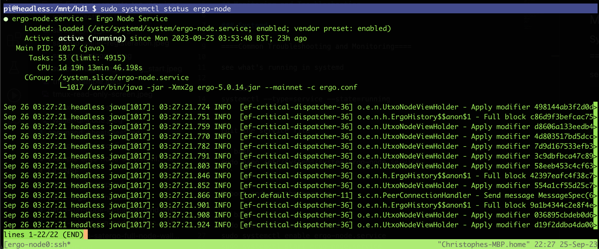

# Part 4: Robust Run Node in Pi Background Systemd (in-work)

## Run on Reboot & in the Background
With Tmux you still have some manual set and stop work to do.

Tmux is really a temporary solution. The robust and reliable way would be to run the node upon pi startup, reboot, and automatically run as a systemd service in the background. Set and forget. 

Follow these readme setps once again from [Chris (Eeysirhc)](https://github.com/Eeysirhc)

https://github.com/Eeysirhc/ergo-rpi#readme

Hat tip to Chris for the great tutorial, largely adapted here with notes.

## systemd

Ideally, your Ergo services run in the background and automatically reboots in the event of an outage. The steps below is one example on how to setup this process for the node on your Raspberry Pi.

### What is systemd service?
[Arch Linux Wiki](https://wiki.archlinux.org/title/Systemd) explains:
>Historically, what systemd calls "service" was named daemon: any program that runs as a "background" process (without a terminal or user interface), commonly waiting for events to occur and offering services. A good example is a web server that waits for a request to deliver a page, or a ssh server waiting for someone trying to log in. While these are full featured applications, there are daemons whose work is not that visible. Daemons are for tasks like writing messages into a log file (e.g. syslog, metalog) or keeping your system time accurate (e.g. ntpd). For more information see daemon(7)

System Control [systemctl](https://man.archlinux.org/man/systemctl.1) - Control the systemd system and service manager, may be used to introspect and control the state of the "systemd" system and service manager.

### Create service

```bash
sudo nano /etc/systemd/system/ergo-node.service
```

### Edit service file

```bash
# The Ergo Node Service (part of systemd)
# file: /etc/systemd/system/ergo-node.service

[Unit]
Description         =Ergo Node Service
Wants               =network-online.target
After               =network-online.target

[Service]
User                =pi
Type                =simple

#note path/to/ergo-node in this tutorial is /mnt/hd1/ergo-node but in general =/path/to/ergo-node
WorkingDirectory    =/mnt/hd1/ergo-node

                    #update the version!!!
ExecStart           =/usr/bin/java -jar -Xmx2g ergo-<VERSION>.jar --mainnet -c ergo.conf
KillSignal          =SIGINT
RestartKillSignal   =SIGINT
TimeoutStopSec      =10
LimitNOFILE         =32768
Restart             =always
RestartSec          =10
#EnvironmentFile    =

[Install]
WantedBy            =multi-user.target
```

### Grant permissions

```bash
sudo chmod 644 /etc/systemd/system/ergo-node.service 
```

### Update systemd

```bash
sudo systemctl daemon-reload
sudo systemctl enable ergo-node.service
sudo systemctl start ergo-node.service
```

## Monitoring and Common Troubleshooting

See the [Command Cheatsheet, System Monitoring & Troubleshooting](./command_cheatsheet.md) guide.

The basic functions will be:
- Stop
- Edit
- Reboot
- Monitor w/ journal
- Grab log file regex sections as needed

Use this command to check status

```bash
sudo systemctl status ergo-node
```

Use this command to monitor

```bash
journalctl --unit=ergo-node --output=cat -f
```

Congrats! You now will run the Ergo Node upon power up, reboot, and blips for a robust decentralized checker as strong as Ergo!

